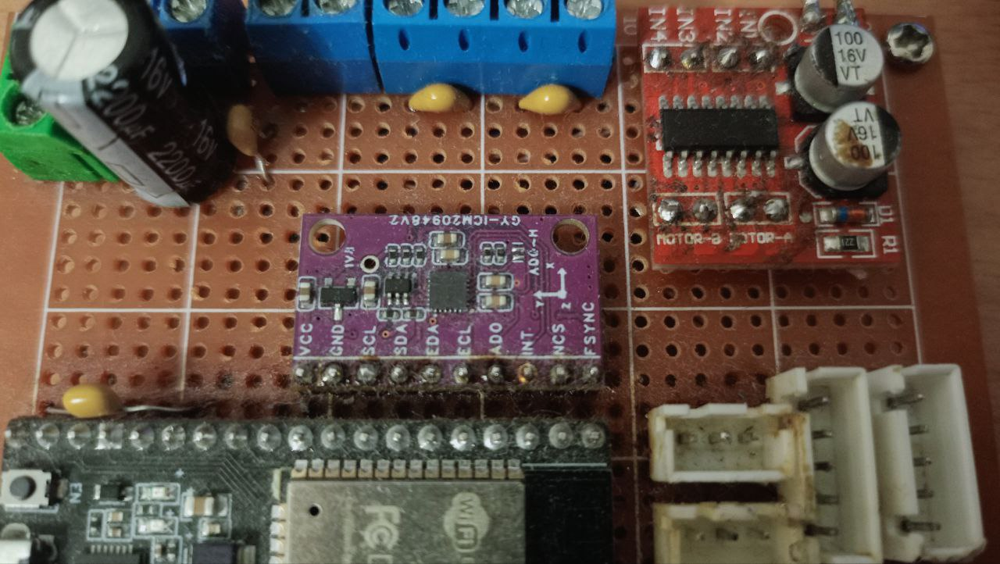
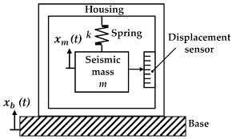
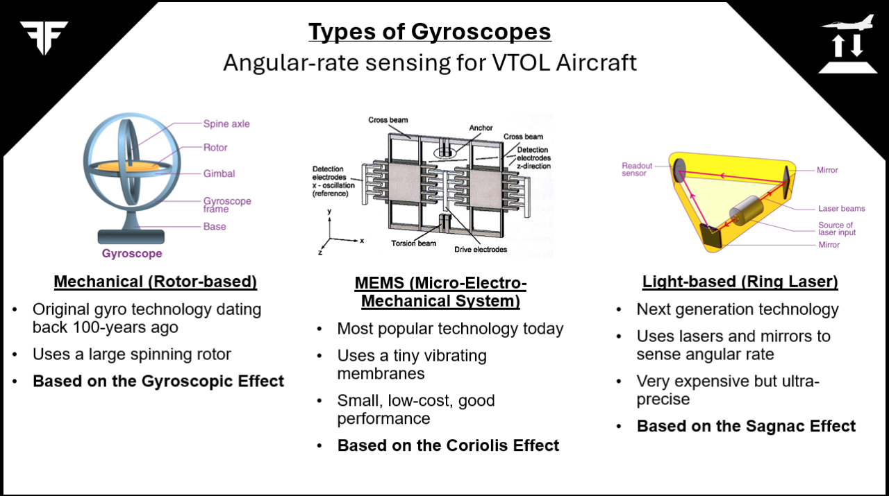
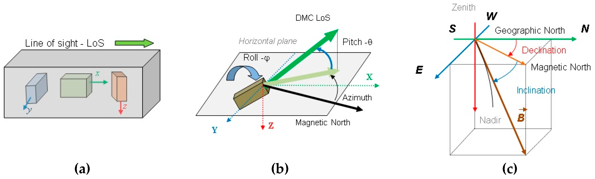
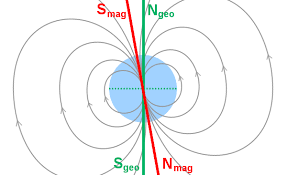
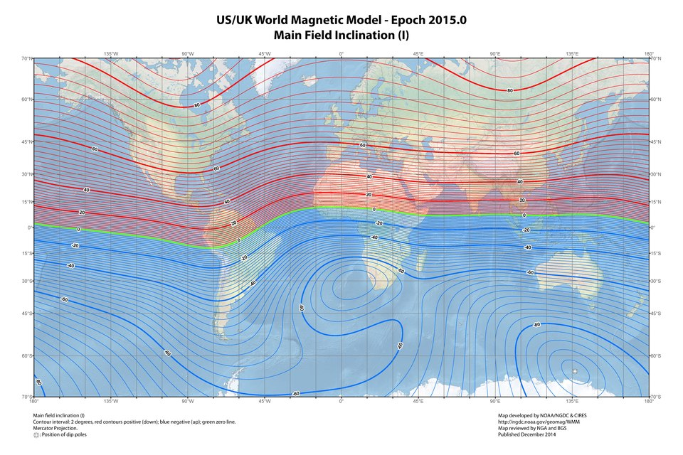
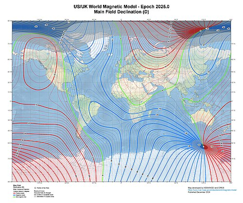
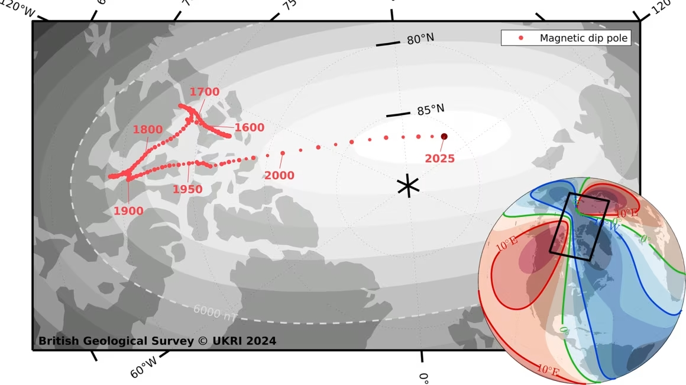
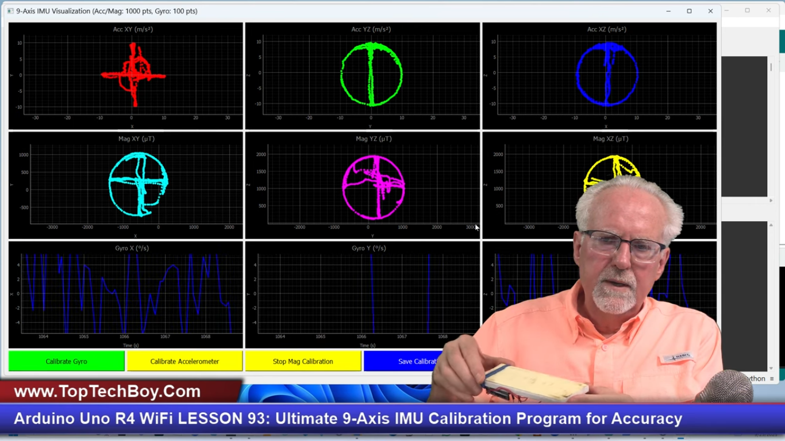
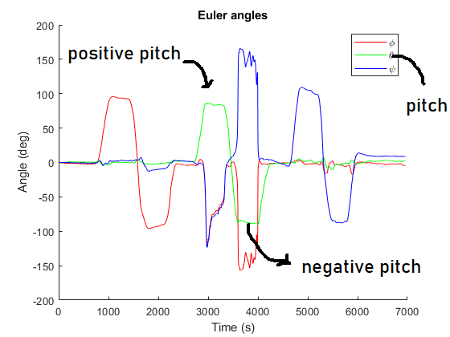

# Работа с IMU (Inertial Measurment Unit)

Если вы сталкивались с тем, что вам надо прикрутить к своему проекту IMU, то знаете, как тяжело с ним работать. Скорее всего вы от него отказались. Но в этом мини гайде я покажу как с ним взаимодействовать правильно.

Самый популярные из них это MPU6050, MPU6500, MPU9250 и самые неточные. Я буду использовать в своем проекте ICM-20948. В нём есть 3-х осевой гироскоп, 3-х осевой акселерометр, 3-х осевой магнетометр в одном чипе (9DOF sensor). Также в нём имеется термометр.



Оригинальный гайд по калибровке MPU6050 и HMC5883l (отдельный модуль магнетометра) смотри [тут](https://toptechboy.com/ultimate-9-axis-program-for-easily-and-accurately-calibrating-a-9-axis-imu-on-arduino/). Я же переделал под себя.

---

## Калибровка:
Если вы положите свой imu сенсор, оставите в покое и посмотрите на значения гироскопа. акселерометра и магнетометра, то увидите, что они сильно отличаются от нуля (кроме оси Z на акселерометре, она должна показывать либо ~9.81, либо ~-9.81).  
Гироскоп в состоянии покоя должен показывать угловые скорости ~0 град/сек (DPS) или ~0 рад/сек (RPS).  
Данные магнетометра после перевода в углы эйлера не должны показывать меньше 0 градусов и не больше 360.

### Акселерометр
Вот как выглядит самая распространенная схема цифрового акселерометра:

. 

Весь принцип работы можете посмотреть в интернете. Смысл калибровки акселерометра заключается в том, чтобы найти **смещения относительно нуля (Offsets) и масштабы (Scales)**.

Калибровка заключается в том, что вы ищете минимальные и максимальные значения g (ускорение свободного падения) для каждой оси. То есть если g~=9.80665, а ваши значения 10.5, то это и есть максимальное значение g для оси x, когда она направленна вверх, а если вы перемернете, можете увидеть значение -10.2, это минимальное значение g для оси x. И так нужно сделать для каждой из осей. Этот метод используется для калибровки IMU для дронов.

Есть более интересный метод, но в конце концов, мы всё равно получим тоже 6 значений: 
1. min_x
2. max_x
3. min_y
4. max_y
5. min_Z
6. max_z

И далее можно воспользоваться **формулами для расчета смещений и масштабов**:
```python
off_x = (max_x + x_min) / 2
off_y = (max_y + y_min) / 2
off_z = (max_z + z_min) / 2
scale_x = (max_x - x_min) / 2
scale_y = (max_y - y_min) / 2
scale_z = (max_z - z_min) / 2
```

**Использование offsets и scales:** 
```python
x_real = (x_raw - off_x) / scale_x  
```
Мы получим результат не м/c^2, а в g, поэтому, чтобы значения были в g, надо поделить на 9.80665:
```python
x_real = (x_raw - off_x) / scale_x / 9.80665 
```

### Гироскоп
Вот схемы гироскопов: 

Суть в том, что независмо от того, какой тип у вашего гироскопа MEMS или Laser-based, у вас все равно сырые значения в состоянии покоя будут плавать. чтобы откалибровать гироскоп, достаточно поставить на ровную поверхность, собрать среднее значение для каждой из оси. Это и есть bias/offset для гироскопа. Желательно собрать минимум 1000 значений.
```python
offset_x = sum(x_values) / nx
offset_y = sum(y_values) / ny
offset_z = sum(z_values) / nz
```
В коде достаточно просто отнять данные смещения от сырых значений: 
```python
x_real = x_raw - offset_x
y_real = y_raw - offset_y
z_real = z_raw - offset_z
```

### Магнетометр
С ним больше всего морок. Так как это самый сложный элемент.
Вот схема магнетометра:

Из-за его сложной конструкции, его тяжелее всего калибровать. Для обычного новичка это может превратиться в ад по нескольким причинам:
1. Магнетометер - это **НЕ КОМПАСС**, он не укажет вам, где находится Северный полюс земли. Он укажет вам на **Магнитный северный полюс земли**. Вот на этой картинке можно понять что это, и почему думать, что "Магнетометер - это компасс":



2. Магнитный северный полюс меняет свое местоположение, а значит и вектор магнитного поля тоже меняет свое направление. Вот по этим картинкам хорошо видно как он меняется за пару лет, и почему **важно калибровать магнитометер каждые полгода-год**:

2015:
 

2025:


Зеленая полоска - это вектор магнитного поля. Перейдя по ссылке и посмотрев видео в начале гайда, вы все поймёте.
Дополнительные видео:



Это все значит, что, чтобы откалибровать магнитометер, его надонаправить на настоящий север и прокрутить по каждой из осей на 360 градусов. После каждого прокручивания, надо аккуратно менять ось и направлять её на настоящий север. 

Таким образом мы получим примерно такую картину:

Как вы можете видеть, мы получим вот такие окружности, надо постраться при калибровке сделать максимально круглые и большие окружности, не шатая сенсор туда сюда.

Мы получили набор значений в теслах или микротеслах (uT). Нам надо получить смещения относительно настоящего севера. Вот шаги:
1. Берем 6 значений из 3 осей: min_x, max_x, min_y, max_y, min_z, max_z.
2. Получает offsets:
```python
off_x = (min_x + max_x) / 2.0
off_y = (min_y + max_y) / 2.0
off_z = (min_z + max_z) / 2.0
```
3. Получаем разброс значений каждой оси:
```python
range_x = max_x - min_x
range_y = max_y - min_y
range_z = max_z - min_z
```
4. Получаем из разброса масштаб:
```python
scale_x = 2.0 / range_x if range_x > 1e-6 else 1.0
scale_y = 2.0 / range_y if range_y > 1e-6 else 1.0
scale_z = 2.0 / range_z if range_z > 1e-6 else 1.0
```

Теперь можно применять это в коде:
```python
x_real = (x - off_x) * scale_x
y_real = (y - off_y) * scale_y
z_real = (z - off_z) * scale_z
```

## Почему после калибровки значения в состоянии покоя все равно отличны от нуля?
### 1. Плохая калибровка:
Как бы вы не старались с первого раза ничего нормально не получится. У меня получилось после двух дней выискивания нормальной траектории вращения датчика. Я даже хотел собрать стенд на шаговике и ардуино, чтобы максимально точно собрать минимальные и максимальные значения.
### 2. Попробуйте другой метод калибровки:
Смысл калибровки в том, чтобы найти минимальные и максимальные значения дл кажой оси. Если вы откроете ссылку, которая лежит в начале гайда, перейдете и посмотрите видео, оторое там есть, то увидете, что лучшая калибровка будет - вращение. Рекомендую посмотреть, что делает и говорит тот мужичок на видео. Зная английский, вы поймете, о чем он говорит.
### 3. Подогрев IMU:
Как бы это странноне звучало, люди, кторые выжимают из дорогих датчиков IMU все соки, клеют к нему вот такой подогреватель из обычных резисторов:

Смылс в том, что люди буквально греют чип, чтобы механизмы внутри чипа (они механические) работали лучше. Это как прогрев машины.
### 4. Используйте фильтр Калмана или Мадгвика:
Смысл в том, что фильтр Калмана очень выручит вас, если у вас значения плавают от -0.04 до +0.04 у акселерометра. Т.к. это сглаживающий фильтр, то вы получите почти 0. Еще я заметил, что у меня угловая скорость плавает от 2 см/сек до -2 см/сек. Если наложит фильтр Калмана, то получится почти идеальный 0.

Фильтр Мадгвика.
Он в отличии от фильтра Калмана вам не поможет определять позицию робота, но он вам поможет определять только углы Эйлера, углы поворота в градусах относительно нуля каждой оси. Для лучшего понимая загуглите, желательно на английском.

### Используйте Extended Kalman Filter (EKF):
В ROS есть отличный пакет [**robot_localization**](https://docs.ros.org/en/melodic/api/robot_localization/html/index.html). Он может объединить колесную одометрию, IMU, одометрию, посчитанную с лидара, визульную одометрию и GPS в одно целое. Не знаю как его сделать без ROS, но при желании на сайтах типа https://www.ieee.org/ или https://arxiv.org/search/eess сможете найти статьи из Европейских, Американкий и других университетов статьи по этому поводу.
